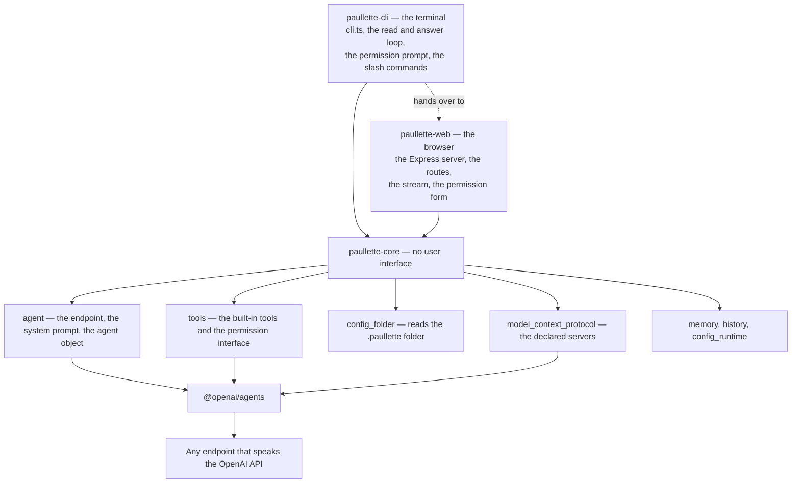
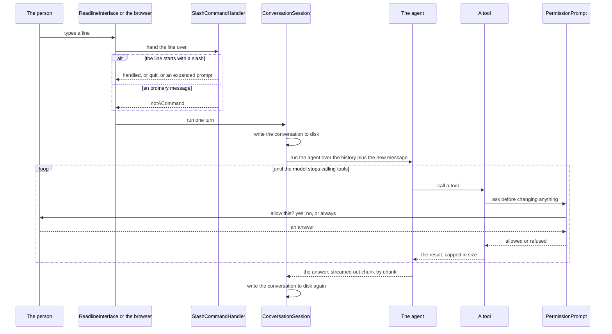

# The architecture of paullette

This page is for somebody working on paullette itself. It says how the parts fit together, in what order they run, and why each boundary is where it is. For how to use paullette, read the [README](../README.md).

## The shape of the whole thing in one paragraph

paullette is a command line program that builds one agent object of the OpenAI Agents software development kit, gives that agent a list of tools, and runs a conversation with it against any endpoint that speaks the OpenAI API. Everything paullette adds on top of the software development kit is one of four things: reading the `.paullette` folder, building the list of tools, asking the user before a tool changes anything, and writing the conversation to disk. The conversation is held either at the terminal or in a browser, and both front ends answer with the same agent object.

## The three packages

The repository is an npm workspace with one package per part.

| Folder | Published as | What it is |
| --- | --- | --- |
| `packages/paullette-core` | `paullette-core` | The agent, the configuration, the `.paullette` folder reader, the history, the memory, the Model Context Protocol layer, and every tool. No user interface. |
| `packages/paullette-web` | `paullette-web` | The web interface: the web server, the Express application, the routes, and the files sent to the browser. This is what `npx paullette web` starts. |
| `packages/paullette-cli` | `paullette` | The terminal interface and the command line entry point. This is what `npx paullette` runs. |

`paullette-core` never imports from either front end, and it never will, because that one rule is what lets both of them sit on the same agent. The two front ends never import from each other either, with one exception written down on purpose: `packages/paullette-cli/src/cli.ts` imports `WebInterface` from `paullette-web`, because `npx paullette web` has to hand over to it, and `cli.ts` is the entry point rather than the terminal interface. `packages/paullette-cli/src/terminal/` imports nothing from `paullette-web`.

Every package reaches another by the package name, never by a relative path that climbs out of its own folder:

```ts
import { ToolRegistry } from 'paullette-core/tools/tool_registry';
```

That one import specifier has to resolve three different ways: to the TypeScript source while type checking, to the TypeScript source while running from source, and to the built JavaScript once published. The `exports` map of `paullette-core` does it with three conditions — `development`, `types`, and `default` — matched by `customConditions: ["development"]` in `tsconfig.base.json` and by `tsx --conditions=development` at run time. There is no `index.ts` barrel file anywhere: a file is always reached by its own path.



The boundary is drawn, but one promise it implies is not yet kept. `paullette-core` still reads files through `node:fs` in `tools`, `history`, `memory`, `config_folder`, and `model_context_protocol`, so it does not run in a browser today. The web interface does not need it to: the whole of `paullette-web` runs in Node.js, and the only thing that reaches a browser is what sits under its `public/chat/` folder.

## The folders inside `paullette-core`

| Folder | What it is responsible for |
| --- | --- |
| `src/agent/` | Points the software development kit at the endpoint, assembles the system prompt, builds the agent object, and runs one turn of a conversation with it. |
| `src/config_runtime/` | Turns the command line options, the environment variables, and the defaults into one validated configuration. |
| `src/config_folder/` | Finds the `.paullette` folder, makes it when it is absent, and reads the instruction document, the subagents, the slash commands, and the skills out of it. |
| `src/tools/` | Every built-in tool, the shape a tool is given, and the interface a tool asks the user through. |
| `src/memory/` | Reads and writes `.paullette/memory`, and keeps its index in step. |
| `src/history/` | Writes the conversation to `.paullette/sessions`, and remembers the lines the user typed. |
| `src/model_context_protocol/` | Reads, starts, and stops the Model Context Protocol servers, and turns their tools into tools of the agent. |

Each of those folders carries its own `CONTEXT.md` saying what may be imported from it and what must not be broken.

## The folders inside `paullette-cli`

| File or folder | What it is responsible for |
| --- | --- |
| `src/cli.ts` | Parses the command line, builds everything, and hands over to the mode that was asked for. |
| `src/terminal/` | Everything that talks to the person at the terminal: the read and answer loop, the permission prompt, the slash commands, the expansion of a slash command file, and the colouring of the output. |

## The folders inside `paullette-web`

| File or folder | What it is responsible for |
| --- | --- |
| `src/web_interface.ts` | `WebInterface.start()`, the one thing `paullette-cli` imports from this package. |
| `src/server/` | The Express application, the routes, the one shared conversation, the server-sent events stream, the permission asker the browser answers, the Markdown, and the serving of the files the browser asks for. |
| `public/` | The page, the three stylesheet rules Bootstrap cannot reach, and the script. `express.static` is mounted on `public/chat/`; the script is TypeScript, and its types are taken out as it is served. Bootstrap itself is served out of `node_modules/bootstrap`. |

The full account of the web interface is in [`web_interface.md`](web_interface.md).

## Startup, in order

Everything below happens in `Main._start` in [`packages/paullette-cli/src/cli.ts`](../packages/paullette-cli/src/cli.ts), in this order. The order matters in three places, and those three are called out.

1. **`ConfigLoader.load`** builds the configuration from the command line options, then the environment variables, then the defaults, and validates the result with a Zod schema. A `PAULLETTE_` variable falls back to the matching `OPENAI_` variable.
2. **`ModelProvider.configure`** points the software development kit at the endpoint. This must come before any agent is built or run. It makes three calls, and the middle one is the one that is easy to miss: the software development kit sends its requests to the Responses API by default, and LM Studio and most other endpoints implement only the Chat Completions API, so `setOpenAIAPI('chat_completions')` is what makes any request work at all. The third call stops the software development kit from sending traces to OpenAI, which fails when there is no OpenAI key.
3. **`ConfigFolderReader.read`** finds the project root, makes the `.paullette` folder and its subfolders when they are absent, and reads the instruction document, the subagents, the slash commands, and the skills.
4. **The permission asker is built by `Main.main` and handed to `Main._start`**, and the **`ToolContext`** is built around it. It is a `PermissionPrompt` for every terminal mode and a `WebPermissionAsker` for the `web` command, and it is the one thing the modes do not share. Every tool from here on is handed that one `ToolContext`.
5. **The `MemoryStore`, the `SessionStore`, and the `ConversationSession` are built.** With `--resume`, the newest session on disk is read back instead of a new one being started.
6. **`ModelContextProtocolSession.start`** reads the declared servers, starts them, and asks each one for its tools. This is the only asynchronous step of the startup, and it is why `_start` returns a promise at all.
7. **The tool list is assembled**, in the order given in the next section.
8. **`SystemPromptBuilder.build`** assembles the system prompt, which needs the instruction document, the skill names, and the memory index — so it must come after step 3 and after the memory store exists.
9. **`AgentBuilder.build`** makes the `Agent` object out of the model name, the system prompt, and the tool list.

`Main.main` then writes one warning line per Model Context Protocol failure, writes the capability line, installs the interrupt handler, and runs the mode that was asked for inside a `try` whose `finally` stops every Model Context Protocol server.

## Where the tools come from

Five sources, assembled in `Main._start` in this order:

```
ToolRegistry.createAll(toolContext)          read_file, write_file, edit_file, list_directory,
                                             glob_files, grep_files, run_shell_command
ModelContextProtocolSession.tools            one per tool of every server that started
MemoryTools.createAll(...)                   memory_list, memory_read, memory_write, memory_delete
SkillTools.createAll(...)                    load_skill, and nothing at all when there are no skills
SubagentTools.createAll(...)                 one per subagent in .paullette/agents
```

Two details of that list are deliberate.

`ToolRegistry.createAll` returns the file tools, the search tools, and the shell tool, and nothing else. That subset has a name in the code — `ordinaryTools` — because it is the only list a subagent is ever given. A subagent gets no memory tool, no skill tool, no Model Context Protocol tool, and no other subagent. A subagent that could call another subagent could call itself.

`SubagentTools` turns each subagent into an `Agent` of its own and then into a tool through `Agent.asTool()`, narrowing the tool list to the names its frontmatter asked for through `ToolRegistry.filterByName`. A name that matches nothing is passed over rather than refused, because a folder copied from a Claude Code project names tools paullette does not have, and losing the whole subagent over one unknown name would be worse than giving it a shorter list.

## What a tool is given, and how it asks

Every tool, built-in or not, is handed the same object:

```ts
export type ToolContext = {
	workingDirectoryPath: string;
	permissionAsker: PermissionAsker;
	logToolCall: (toolName: string, summary: string) => void;
};
```

`PermissionAsker` is an interface, not a class, and that is the single most load-bearing decision in the tool layer. It is why `src/tools/` never imports from `src/terminal/`: the terminal package implements it with a prompt at the terminal, `paullette-web` implements it by parking the promise until a browser answers over a separate request, and a unit test implements it with a fake that answers the same way every time. The tool does not know and must not know.

A request carries three things — the name of the tool, one line saying what is about to happen, and the text the user should read before deciding:

```ts
export type PermissionRequest = {
	toolName: string;
	summary: string;
	detail: string | undefined;
};
```

`PermissionPrompt` answers it. With `--yes` it always allows. With an answer of `a` it remembers that tool name for the rest of the session, in memory only, never on disk. **When there is no terminal to ask at, the answer is no.** That is the safe direction, and it is what makes paullette safe to run from a script: with its input closed and no `--yes`, it cannot change a file that nobody approved.

`logToolCall` writes to the standard error and never to the standard output. That split runs through the whole program: with `--print`, the answer of the model is the only thing on the standard output, so a caller can read it on its own.

## One turn



Two things in that picture are worth saying in words.

**The conversation is written to disk before the model is called, not only after it answers.** That is why every way of leaving paullette is safe: the interrupt key, `/exit`, and the input stream closing all lose at most the turn that was in flight. `SessionStore.save` rewrites the whole file each time rather than appending, so a session file on disk is always a complete and readable conversation.

**A refused tool call is not an error.** The tool returns a plain sentence for the model to read — `The user refused to let you run that command. Do not try again.` — and the turn carries on. Throwing would end the turn and lose the answer.

## The `.paullette` folder reader

`ConfigFolderLocator` walks up from the working folder looking for a `.git`, and treats the nearest folder that has one as the project root, falling back to the working folder. That is what makes paullette behave the same from any subfolder of a project.

paullette reads exactly one folder, at the project root. It does not read `~/.claude`, and it does not walk up through a chain of parent folders. Adding that later would touch only the locator.

Every loader follows the same three rules:

- The file formats are the Claude Code formats, unchanged, so an existing `.claude` folder works by being copied across. That is why a subagent tool list parses from either `tools: ["Read", "Grep"]` or `tools: Read, Grep` — both spellings appear in real files.
- A file whose frontmatter cannot be understood is skipped, never thrown on. One bad file in a copied folder must not stop paullette from starting.
- Nothing in the folder calls the model or asks the user anything. It reads files and returns what it found.

`FrontmatterParser` splits a Markdown file into its YAML frontmatter and its body, and returns an empty frontmatter with the whole text as the body when there is none or when the YAML is broken. A file that holds only instructions is still useful.

The one behaviour that surprises people: **the `model` field of a subagent is read and then ignored.** paullette runs the single model it was configured with. A folder copied from a Claude Code project names Anthropic models the configured endpoint does not serve, so honouring the field would break more often than it helped.

The full format reference is in [`paullette_folder.md`](paullette_folder.md).

## The system prompt

`SystemPromptBuilder.build` joins up to four sections: the general wording, the instruction document when there is one, the list of skills when there are any, and the memory section when the memory tools are there.

A skill contributes **only its name and its description** to the prompt, never its instructions. The instructions arrive later, through the `load_skill` tool, and only when the agent decides it needs them. The memory works the same way: the prompt carries the one-line index out of `MEMORY.md`, and a whole fact arrives only through `memory_read`.

Both are the same decision made twice. The target is a small local model with a small context window, and a prompt that carried every skill and every remembered fact in full would leave no room for the work.

## The memory

One fact lives in one Markdown file in `.paullette/memory`, with YAML frontmatter carrying a name, a one-line description, and a type of `user`, `feedback`, `project`, or `reference`. `MEMORY.md` beside them holds one line per file.

The index is **rewritten from the files that are actually there** on every write and every delete, never appended to. An index that is appended to drifts away from the files beside it the first time somebody deletes a file by hand; an index that is regenerated cannot.

## The Model Context Protocol layer

`ModelContextProtocolSession` is the only file `cli.ts` touches. Behind it:

```
ModelContextProtocolConfigReader   reads and merges the three source files
ModelContextProtocolServerLauncher builds and connects a server per entry, and closes them all
ModelContextProtocolTools          one tool of the agent per tool of a server
```

The rule that shapes all of it: **nothing in the folder ever throws at the caller.** A file that is broken, an entry that names neither a command nor a url, a server that is not installed, a server that does not answer within twenty seconds, and a server that will not list its tools all become a `ModelContextProtocolWarning`, printed as one `paullette-warning:` line, and paullette starts with the servers that do work. One missing server must never keep a person from reaching the prompt.

The conversion from a server tool to an agent tool reuses `mcpToFunctionTool` from the software development kit and replaces only its `invoke`, so paullette never restates a JSON schema. The replacement writes the tool call line, asks the permission asker, and caps the result — which is exactly what a built-in tool does.

The full reference is in [`mcp_server.md`](mcp_server.md).

## The configuration

`PaulletteConfig` is a Zod schema, so a bad value fails at startup with a readable message rather than somewhere further in. A setting is read from the command line first, then from the environment, then from the default.

The defaults point at a local endpoint on purpose: `http://127.0.0.1:1234/v1`, which is where the LM Studio local server listens, with the model `qwen3.5-4b`. Nothing is sent anywhere else and no account is needed.

`qwen3.5-4b` is the default for a reason written down in `TODO.md`: the smaller `google/gemma-4-e2b` answers well and calls a one-argument tool, but emits malformed JSON for the four-field object that `memory_write` takes, so the call never reaches the tool and the memory silently fails to save. A default model that cannot use a whole feature of the product is the wrong default.

## The rules that run through everything

These five appear in more than one folder, so they are worth naming once.

**Never throw at the caller over something outside paullette.** A broken file, a missing server, a subagent naming a tool that does not exist: each is skipped or warned about, and the run carries on. The one thing that stops paullette is a configuration that fails its schema.

**Every result the model reads is capped.** `ToolPaths.capOutput` cuts anything over thirty thousand characters and says how many characters were dropped. One unbounded file or one unbounded command output would otherwise fill the context window and end the conversation.

**Every path a tool is given is resolved inside the working folder.** `ToolPaths.resolveInside` refuses a path that climbs out. The model chooses these paths, and a small model asked to read a project file produces `../../` often enough that this is not a theoretical concern.

**Anything that changes the world asks first.** Writing a file, editing a file, running a shell command, remembering a fact, forgetting a fact, and calling a tool of a Model Context Protocol server all go through the same one interface. Reading a file, searching, and listing a folder do not.

**The standard output carries the answer, and nothing else.** Every warning, every tool call line, every permission question, and the capability line go to the standard error.

## The capability line

paullette writes one line to its standard error on every run:

```
paullette-capabilities: {"toolNames":[...],"hasMemory":true,"hasSessions":true,"hasWebInterface":true,"modelContextProtocolServerNames":["now"]}
```

It exists so that a check can tell a part that is not built yet from a part that is built and wrong. It was added after a real false green: a check that a file write is refused passed on its own, for the simple reason that there was no file writing tool at all. Its shape is kept in step by hand with the `PaulletteCapabilities` type in `test/libs/verification_types.ts`, which cannot import from the source.

## The modes

`cli.ts` runs exactly one of six modes and then stops every Model Context Protocol server:

| Mode | What it does | Calls the model? |
| --- | --- | --- |
| `web` | Starts a local web server and serves the web interface until the interrupt key stops it. | yes |
| `--list` | Prints what was read out of the `.paullette` folder, and the servers that started, as JSON. | no |
| `--expand <command>` | Prints what a slash command expands to. | no |
| `--print <prompt>` | Answers one prompt on the standard output. | yes |
| no option, with a terminal | The read, answer, and repeat loop. | yes |
| no option, without a terminal | Refuses, and says to use `--print`. | no |

The program itself carries an action handler, even an empty one. Without it, Commander treats a program that has a command as a program that must be **given** one, and answers `paullette --list` with the help text instead.

## Testing

Two suites that cover different failures and do not replace each other. The full account is in [`testing.md`](testing.md).

## What is not built

- **The interactive loop is unverified.** Driving it needs a pseudo terminal, because `_runInteractive` refuses to start when the input is not a terminal. `/help`, `/exit`, the interrupt key, and the streaming of the answer are written but nothing checks them.
- **`paullette-core` is not free of Node.js**, so the promise that it runs in a browser is not yet kept. The web interface does not need it kept, because `paullette-web` runs in Node.js.
- **The web interface has no slash commands**, no way to carry on a past conversation, and no account or password. What it does have is in [`web_interface.md`](web_interface.md).
- **The Model Context Protocol resources and prompts** are not read. Tools only.
- **There is no command to add, to remove, or to list a Model Context Protocol server.** Write the JSON file by hand.
- **A subagent runs the one configured model**, whatever its frontmatter says.

## Where to add a new thing

**A new tool.** Add a file under `packages/paullette-core/src/tools/`, with a static class named after the file and a `createAll(context)` that returns the tools. Call the permission asker if it changes anything, call `logToolCall` either way, put every path through `ToolPaths.resolveInside`, and put every result through `ToolPaths.capOutput`. Add it to `ToolRegistry.createAll` only if a subagent should get it too; otherwise add it to the list in `Main._start`. Write the unit test beside it, calling the tool through `ToolHarness.invoke` so that the schema of the tool is part of what is tested.

**A new slash command that paullette answers itself.** Add the name to `BUILT_IN_NAMES` in `slash_command_handler.ts` and a branch in `_handleBuiltIn`, and add the line to `_writeHelp`.

**A new front end.** Implement `PermissionAsker`, have `Main.main` build it and hand it to `Main._start`, and add a mode to `cli.ts`. Everything else `_start` builds is already shared. Do not add anything to `paullette-core` that knows a terminal or a browser exists, and do not import one front end from another.

**A new source of tools.** Follow the shape of `src/model_context_protocol/`: one class that starts, one that converts, one session object that `cli.ts` starts and closes, and no exception ever thrown at the caller.
