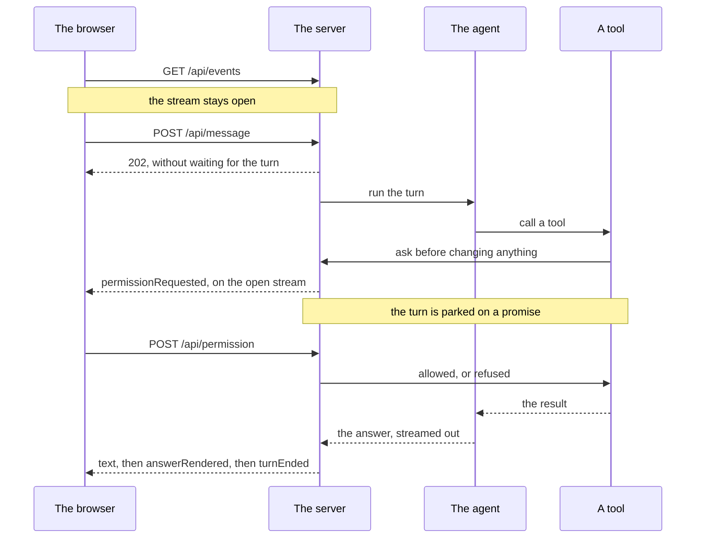

# The web interface of paullette

`npx paullette web` starts a local web server and serves a conversation with paullette in a browser, in place of the terminal interface.

```
$ npx paullette web
paullette web interface is served at http://127.0.0.1:5000
```

Open that address in a browser. The page holds the conversation, shows a permission question as a form, and lists the conversations already saved in `.paullette/sessions`.

## The options

| Option | What it does |
| --- | --- |
| `--port <number>` | The port to listen on. `5000` by default. `0` asks the operating system for a free one, and paullette prints the port it got. |
| `--host <address>` | The address to listen on. `127.0.0.1` by default. |

Every option the other modes accept works here too, on either side of the command name: `paullette --yes web` and `paullette web --yes` do the same thing. So do `--resume`, `--model`, `--base-url`, `--api-key`, and `--max-turns`.

## The address it listens on, and why the default is the loopback address

The agent behind this server writes files and runs shell commands on the machine that started it. Anyone who can reach the address can make it do that, and there is no account and no password. So the default address is `127.0.0.1`, which nothing outside the machine can reach.

`--host` still accepts anything, because reaching paullette from a browser on another machine is one of the reasons [issue #2](https://github.com/jeromeetienne/paullette/issues/2) asked for the web interface. An address that is not the loopback address is said out loud and the server starts anyway:

```
$ paullette web --host 0.0.0.0
paullette-warning: listening on 0.0.0.0 rather than 127.0.0.1. Anyone who can reach that address can make paullette run shell commands on this machine.
paullette web interface is served at http://127.0.0.1:5000
```

## What the browser and the server say to each other

The browser reads one stream and sends everything it has to say in an ordinary request.

| Method and path | What it does |
| --- | --- |
| `GET /` | The page. `GET /css/chat_page.css`, `GET /js/chat_page.js`, and `GET /vendor/bootstrap/bootstrap.min.css` are the three files it asks for. |
| `GET /api/events` | The stream of everything that happens in the conversation, as server-sent events. |
| `GET /api/state` | The conversation so far and the question waiting for an answer, for a browser that has just connected. |
| `POST /api/message` | Starts one turn. It answers `202` at once and does not wait for the turn. |
| `POST /api/permission` | Answers one permission question. |
| `GET /api/sessions` | The past conversations in `.paullette/sessions`, newest first. |
| `GET /api/sessions/<identifier>` | One past conversation. |

The events written on the stream: `turnStarted`, `text`, `toolCalled`, `toolOutput`, `permissionRequested`, `permissionAnswered`, `answerRendered`, `turnEnded`, and `error`.

The routes under `/api` are one Express router, mounted at `/api` on an Express application that `node:http` serves. The application is put together in the order any Express application is:

```
express.json({ limit: '200kb' })              the reader of a body
/api                 -> WebApiRouter          everything the browser asks
/js                  -> WebBrowserScript      the script, made from its TypeScript
/vendor/bootstrap    -> express.static        the stylesheet of Bootstrap, off the disk
/                    -> express.static        public/chat/
                        the address nothing is served at
                        the answer of last resort
```

Nothing else is mounted, no compression above all: the stream at `/api/events` has to reach the browser as each event is written, and a compressor holds what it is given until it has enough of it to be worth compressing.

Server-sent events were chosen over a websocket because the stream only ever runs one way, from the server to the browser. Everything the browser has to say fits in a short request.

## One permission question, answered from a second request

This is the part the whole design rests on.



`WebPermissionAsker` implements the same `PermissionAsker` interface that `PermissionPrompt` implements at the terminal. `ask` parks a promise and tells the server; the server writes one `permissionRequested` event; `POST /api/permission` finds the parked promise by its identifier and resolves it. The tool was waiting the whole time and carries on as though nothing had happened.

Two rules follow from that:

- **An answer of "always allow" is remembered for this run only, never written to disk.** That is the same rule the terminal interface follows.
- **Closing the server refuses every question still waiting.** A tool parked on a question nobody will ever answer would hold the turn, and the turn would hold the process.

## One server, one conversation, several browsers

Every browser that connects reads the same stream and sees the same conversation, and any of them may send the next message or answer the waiting question.

Only one turn runs at a time. A message sent while a turn is running is refused with a sentence a person can read, and never queued. The agent runs tools in one working folder, and two turns at once would edit the same files with neither one knowing.

## Nothing the model writes becomes an element in the page

The answer is shown twice. While it streams, each piece is added to the page as plain text, so the answer appears word by word. When the turn ends, the server sends the finished answer already turned into HTML and the browser replaces the block.

`WebMarkdown` turns the Markdown into HTML with `marked`, and replaces three of its renderers:

- `html` writes the HTML the model wrote as visible text instead of passing it through as an element.
- `link` drops the address when its scheme is not `http`, `https`, or `mailto`, so a link whose address starts with `javascript:` arrives as its own words and nothing else.
- `image` never writes an `img` element and writes a link instead. A page that fetched an address the model chose would tell whoever owns that address what the model wrote.

The escaping happens **inside** the renderer and not before it. Escaping the text first was tried and was wrong: `marked` escapes the ampersand again inside a code block, so `1 < 2` came out as `1 &lt; 2` on the screen. A coding agent writes comparison operators inside code fences constantly.

The page itself never builds HTML out of text. The HTML of an answer always comes from the server, which has already made sure of all of the above.

## What the page looks like: Bootstrap, and forty lines of our own

Everything the page looks like comes from Bootstrap. It is a dependency of `paullette-web`, and it is read off the disk of the machine paullette runs on, at `node_modules/bootstrap/dist/css/bootstrap.min.css`, never fetched from a content delivery network. The server listens on the loopback address by default, and a page that needed the internet to look right would be wrong.

The elements of the page carry Bootstrap classes and nothing else, and `public/chat/css/chat_page.css` holds three rules. Each one is there because no Bootstrap class can reach what it does, and each one says so beside itself:

| The rule | Why it cannot be a Bootstrap class |
| --- | --- |
| The borders of a table inside an answer | The HTML of an answer is written by `marked`, which puts a class on nothing, and Bootstrap styles a table only through the class `table`. |
| `white-space: pre-wrap` while an answer streams | Bootstrap has a class for wrapping and one for not wrapping, and none for keeping the spacing of the text as it was written. |
| A cap on the height of the detail of a permission question | Bootstrap has no class that caps a height, and the detail can be a whole file, which would push the three buttons off the bottom of the screen. |

Bootstrap follows the light or dark setting of the machine for nothing on its own: it reads `data-bs-theme` off the `html` element. Six lines at the top of `index.html` set that attribute from `prefers-color-scheme` and follow it when it changes. They run in the head of the page, before it is drawn, so that a person who has asked for a dark screen is never shown a white one first.

## Where the files are

```
packages/paullette-web/
	src/web_interface.ts          WebInterface.start(), the one thing paullette-cli imports
	src/server/                   the server, the application, the routers, the stream, the permission asker
	public/chat/index.html        the page
	public/chat/css/chat_page.css the three rules Bootstrap cannot reach
	public/chat/src/chat_page.ts  the script, in TypeScript
	tsconfig.browser.json         the one configuration that checks TypeScript against a browser
```

`public/` sits beside `src/` and never inside it, because `tsc` copies no file that is not TypeScript. It is found at run time with `Path.join(import.meta.dirname, '..', '..', 'public')`, which resolves the same way from `src/server/` during development and from `dist/server/` once published.

`express.static` is mounted on `public/chat/` and on the stylesheet folder of Bootstrap, and nothing resolves a path from a web address by hand. `express.static` refuses a path that climbs out of the folder it was mounted on. `SessionStore.loadSession` takes the same care in the one place a path is still built from what a browser sent: it refuses any identifier that is not the shape `startSession` makes, because that identifier arrives from `GET /api/sessions/<identifier>`.

## The script of the page is TypeScript, and nothing builds it

`public/chat/src/chat_page.ts` is TypeScript, and a browser runs JavaScript. `WebBrowserScript` is the one step between the two: on every request for `/js/chat_page.js` it reads the TypeScript and hands it to `stripTypeScriptTypes` of `node:module`, which replaces each type with as many spaces as it took. Every line and every column of what the browser runs is where it is in the file on disk, and the JavaScript ends with `//# sourceURL=/src/chat_page.ts`, which `express.static` serves as text.

There is no build step and no built file sitting beside its source going stale. Editing the script and reloading the page is the whole of what it takes to see the change, whether paullette is run from a clone or installed from npm. What it costs:

- The script may hold no `enum` and no `namespace`. They are the two things types cannot simply be taken out of, and either one stops the page from being served at all.
- Node.js 22.13 or newer is needed. `stripTypeScriptTypes` arrived there, and it is why the `engines` field of this package asks for it.
- Node.js says once, on the first page a browser opens, that `stripTypeScriptTypes` is still an experimental feature.

The script imports the types of every event and every body from `src/server/web_types.ts`, as types and never as values, so the two sides cannot drift apart. Those imports are gone from what the browser is sent. They are checked by `tsconfig.browser.json`, which is the one configuration in this repository that declares the library of a browser and no type of Node.js.

## What it does not do yet

- **No slash commands.** `SlashCommandHandler` writes to a terminal today.
- **No carrying on a past conversation.** The past conversations can be read, which is what [issue #2](https://github.com/jeromeetienne/paullette/issues/2) asked for. Carrying one on is what `--resume` does at the terminal.
- **No account and no password.** See the section on the address it listens on.

## How it is checked

Two verification steps, both in `npm run verify`:

- `webInterfaceServed` calls no model. It starts `paullette web --port 0` and asks for the page, the script, the stylesheet of Bootstrap, the state, and an address nothing is served at. It checks that the script holds the class the page runs and no TypeScript a browser could not.
- `webTurnAnswered` holds a whole turn: it opens the stream, sends a message, answers the permission question over a second request while the turn is parked on it, waits for `turnEnded`, and then reads the file the tool wrote off the disk.

The unit tests of `packages/paullette-web` never call a model, and the one that asks the routes for an answer starts the Express application on a port the operating system chooses, so that two test runs at once cannot collide. The full account of both suites is in [`testing.md`](testing.md).

The design of all of this, and the live test that proved the parked promise could be released from a second request before any of it was written, are in the plan on [issue #9](https://github.com/jeromeetienne/paullette/issues/9).
